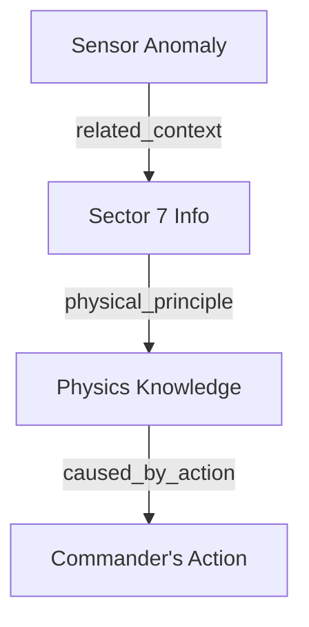

# Mars Colony Simulation Demo

This demo simulates a cognitive retrieval scenario for an AI agent managing a Mars colony. It demonstrates how **MemoryGraph** unifies vector search and graph traversal to solve complex reasoning tasks that neither vector databases nor graph databases can solve efficiently alone.

## 1. The Knowledge Graph

The dataset (`data/mars_colony.json`) consists of 4 memories linked by causal relationships.

### Nodes (Memories)

1.  **[Episodic] Sensor Anomaly**
    *   *Content:* "Sensor anomaly detected in Sector 7. Thermal spikes observed."
    *   *Vector:* `[0.8, 0.1, 0.1]` (High similarity to "thermal spike")
    *   *ID:* `...423c`

2.  **[Semantic] Location Fact**
    *   *Content:* "Sector 7 houses the main fusion power conduit."
    *   *ID:* `...41e5`

3.  **[Semantic] Physics Knowledge**
    *   *Content:* "Fusion conduits emit thermal spikes when coolant pressure is low."
    *   *ID:* `...43a0`

4.  **[Episodic] Commander's Action**
    *   *Content:* "Commander Lewis authorized a coolant flush yesterday."
    *   *Vector:* `[0.1, 0.1, 0.9]` (High similarity to "Commander Lewis")
    *   *ID:* `...43b1`

### Edges (The "Why" Chain)

The simulation programmatically builds these edges:



## 2. Scenarios

### Scenario A: Root Cause Analysis (Outbound Traversal)
**The Problem:** The agent detects a "thermal spike". It needs to find *why* it happened.
**The Query:**
1.  **Vector Search:** Find memories matching "thermal spike". -> Finds **Sensor Anomaly**.
2.  **Graph Traversal (Depth 2):** Follow outbound edges to find connected context.
    *   Anomaly -> Sector 7 -> Physics -> **Commander's Action**.

**Result:** The agent successfully links the raw sensor data to the Commander's administrative action, explaining the spike.

### Scenario B: Contextual Recall (Inbound Traversal)
**The Problem:** The user asks, "What was the impact of Commander Lewis's decision?"
**The Query:**
1.  **Vector Search:** Find memories matching "Commander Lewis". -> Finds **Commander's Action**.
2.  **Graph Traversal (Inbound, Depth 2):** Follow incoming edges backwards to see what this action caused/explains.
    *   Action <- Physics <- Sector 7 <- **Sensor Anomaly**.

**Result:** The agent retrieves the sensor anomaly as a downstream effect of the Commander's action.

## 3. Running the Simulation

```bash
cargo run --example mars_simulation
```
